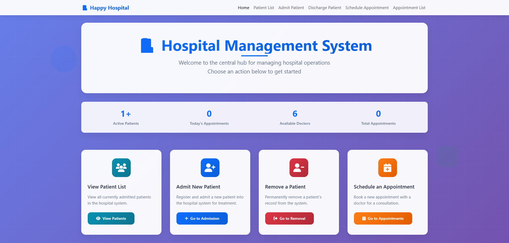
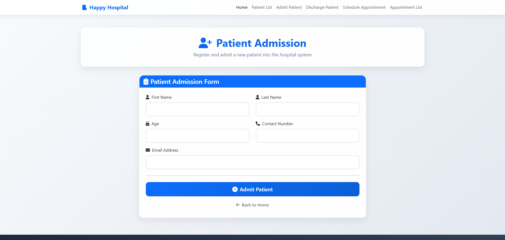
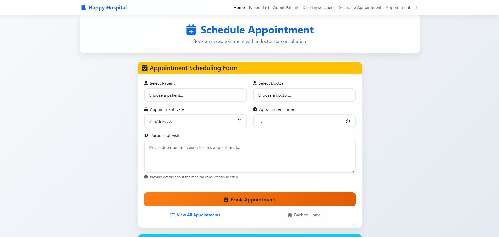

# Django Hospital Management

A simple, modern Django application for managing patients, doctors, and appointments. It uses SQLite by default and Bootstrap 5 (via CDN) for UI.

Repository: https://github.com/AsifShawon/django-hospital-management.git

## Features
- Manage patients (admit/discharge, view list and details)
- Schedule and list appointments
- Seed sample doctors via a custom management command
- Clean Bootstrap 5 interface

## Example Screen Shots






## Tech Stack
- Python 3.11+
- Django 5.2
- SQLite (development default)

## Prerequisites
- Git
- Python 3.11+ (Windows users typically have the `py` launcher)

## Quick Start (Windows, cmd.exe)

1) Clone the repository

```
git clone https://github.com/AsifShawon/django-hospital-management.git
cd django-hospital-management
```

2) Create and activate a virtual environment

```
py -m venv .venv
.venv\Scripts\activate
```

3) Upgrade pip and install dependencies

- If a requirements file exists:

```
py -m pip install --upgrade pip
py -m pip install -r requirements.txt
```

- If there is no requirements file, install Django (and optional helpers):

```
py -m pip install --upgrade pip
py -m pip install "Django>=5.2,<6.0"
```

4) Apply database migrations

The `manage.py` lives in the `hospital_project` folder.

```
cd hospital_project
python manage.py migrate
```

5) (Optional) Create a superuser for the admin site

```
python manage.py createsuperuser
```

6) (Optional) Seed sample data (doctors)

```
python manage.py create_dummy_doctors
```

7) Run the development server

```
python manage.py runserver
```

Visit http://127.0.0.1:8000/ in your browser. Admin is at http://127.0.0.1:8000/admin/.

## Project Structure
```
django-hospital-management/
├─ README.md
├─ hospital_project/
│  ├─ manage.py
│  ├─ db.sqlite3
│  ├─ hospital/                # Django app
│  ├─ hospital_project/        # Project settings/urls/wsgi
│  └─ templates/               # Base and app templates
└─ .venv/                      # Virtual environment (local)
```

## Common Commands
- Make migrations (if you change models):
  ```
  python manage.py makemigrations
  python manage.py migrate
  ```
- Run development server:
  ```
  python manage.py runserver
  ```
- Create admin user:
  ```
  python manage.py createsuperuser
  ```
- Load dummy doctors:
  ```
  python manage.py create_dummy_doctors
  ```

## Configuration Notes
- Default database: SQLite at `hospital_project/db.sqlite3`.
- Templates directory configured at `hospital_project/templates` (see `TEMPLATES.DIRS` in `hospital_project/hospital_project/settings.py`).
- Debug is enabled for development (`DEBUG = True`). Do not use this in production. The provided `SECRET_KEY` is for local dev only—replace it for production and use environment variables.

## Troubleshooting
- pip not recognized: ensure Python is on PATH or invoke with `py -m pip ...`.
- Wrong working directory: ensure you run manage.py commands from the `hospital_project` directory.
- Fresh start: stop server, delete `db.sqlite3`, then rerun `python manage.py migrate` and optional seed/createsuperuser.
- Port already in use: run `python manage.py runserver 0.0.0.0:8001` (or another free port).

## macOS/Linux Quick Notes
Replace activation and Python launcher commands accordingly:
```
python3 -m venv .venv
source .venv/bin/activate
python -m pip install --upgrade pip
python -m pip install -r requirements.txt  # or install Django as shown above
cd hospital_project
python manage.py migrate
python manage.py runserver
```

## License
This project is provided as-is for educational/demo purposes. Refer to the repository for license details if provided.

By [Asif Bhuiyan Shawon](https://withshawon.vercel.app/)
